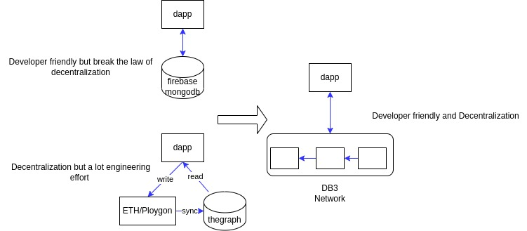

<p align="center">
 
<p align="center"> A ⭐️ is welcome!
  
<p align="center">


[](https://github.com/dbpunk-labs/db3/issues?q=is%3Aopen+is%3Aissue+label%3A%22good+first+issue%22)

[](https://twitter.com/Db3Network)
[](https://www.gitpoap.io/gh/dbpunk-labs/db3)
[](https://discord.gg/sz3bmZx2uh)

**English | [中文](./README_zh_cn.md)**

## What's DB3 Network?

DB3 Network is an open-source, decentralized firebase firestore alternative to build dApps quickly and less challenging.

<p align="left">
 

## Why DB3 Network


Currently, there are two types of Data architecture for dApp(decentralized application): centralized vs. decentralized.
  
**Centralized**: use [Firebase](https://firebase.google.com)
 or [MongoDB](https://github.com/mongodb/mongo)to store the data), both of which are developer-friendly. However, dApps would be regarded as less secure based on a central database.
  
**Decentralized**: use Ethereum or other blockchains to store the data and use [the Graph](https://thegraph.com/en/) to index data from it. The separation of the storage and the indexer would cause many issues in future development.
  
With Db3 network, you can get both advantages of the above two choices.


# Features
**Schemaless**
You can store data on the DB3 Network without any changes.

**High Performance**

Currently, decentralization means terrible performance, but DB3 is trying to improve it significantly:
* [Merkdb](https://github.com/dbpunk-labs/db3/issues/100) is the storage engine of the DB3 Network, and it has high Performance and fast-proof generation. 
* Geo distribution: the nodes in every storage shard are geo-distributed, and the clients can execute queries against the nearest storage node.
* [Query session](./docs/query.md), the first decentralized query protocol to resolve Performance and incentive perfectly.

**Data Ownership**

We proposed [the document level ownership](https://github.com/dbpunk-labs/db3/issues/271), and every document has its owner, while only the owner holds the private key can update/delete the record. DB3 network generates the proofs and provides signatures to prove the membership (db3 has the specific document) and ownership.

**Programmable**

Dapp developers can develop data processing contracts and deploy them to the DB3 Network, just like the data backend in web2.

**Ethereum Guarded Security**

DB3 Network is a layer2 network on Ethereum and Ethereum guards all the assets.

# Getting Started

### Start A Local Testnet

```shell
git clone https://github.com/dbpunk-labs/db3.git
cd db3 && bash install_env.sh && cargo build
# start localnet
cd tools &&  sh start_localnet.sh
```

### Start building

```typescript
/*
|----------------------------|
| use db3js open a database  |
|----------------------------|
*/

// build sign function
const sign = await getSign()

// build database factory
const dbFactory = new DB3Factory({
    node: 'http://127.0.0.1:26659',
    sign,
    nonce
})

// open database with an address
const db = dbFactory.open("0x5ca8d43c15fb366d80e221d11a34894eb0975da6")
```
for more please go to [db3.js](https://github.com/dbpunk-labs/db3.js)

# Project assistance

* Add a GitHub Star⭐️ to the project.
* Tweet about how to use DB3 network.
* Write blogs about the project on [Dev.to](https://dev.to/), [Medium](https://medium.com/) or your personal blog.

Together, we can make db3 network better!


# The internal of db3


# The Architecture


# How it works

* [mutation](./docs/mutation.md)
* [query session](./docs/query.md)
* [dvm](./docs/dvm.md)
* [merkdb](https://github.com/dbpunk-labs/db3/issues/100)


# Other Decentralized Database

* [the graph](https://github.com/graphprotocol/graph-node), a decentralized on-chain indexer
* [Locutus](https://github.com/freenet/locutus), a decentralized key-value database
* [ceramic network](https://github.com/ceramicnetwork/ceramic), a decentralized data network that brings unlimited data composability to Web3 applications
* [kwil](https://github.com/kwilteam), the first permissionless SQL database for the decentralized internet
* [spaceandtime](https://www.spaceandtime.io/), a decentralized data Warehouse
* [OrbitDB](https://github.com/orbitdb/orbit-db) is a serverless, distributed, peer-to-peer database


# Thanks support

 **I stood on the shoulders of giants and did only simple things. Thank you for your attention.**
<table>
  <tr>
    <td align="center"><a href="https://protocol.ai/"><br /><sub><b>Protocol Labs</b></sub></a></td>
    <td align="center"><a href="https://filecoin.io/"><br /><sub><b>Filecoin</b></sub></a></td>
  </tr>
</table>

# License
Apache License, Version 2.0
   ([LICENSE-APACHE](LICENSE-APACHE) or http://www.apache.org/licenses/LICENSE-2.0)

# Contribution

Unless you explicitly state otherwise, any contribution intentionally submitted
for inclusion in the work by you, as defined in the Apache-2.0 license, shall be
dual licensed as above, without any additional terms or conditions.
See [CONTRIBUTING.md](CONTRIBUTING.md).

