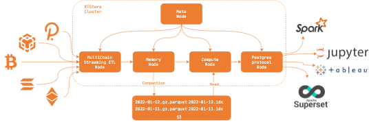

# rtstore

rtstore is a web3 timeseries database for data analytics

## Status
It's under a very early stage, if you are interested in this project, Issues, Discussions or PRs are welcome. 

## License
Apache License, Version 2.0
   ([LICENSE-APACHE](LICENSE-APACHE) or http://www.apache.org/licenses/LICENSE-2.0)

## Contribution

Unless you explicitly state otherwise, any contribution intentionally submitted
for inclusion in the work by you, as defined in the Apache-2.0 license, shall be
dual licensed as above, without any additional terms or conditions.
See [CONTRIBUTING.md](CONTRIBUTING.md).
