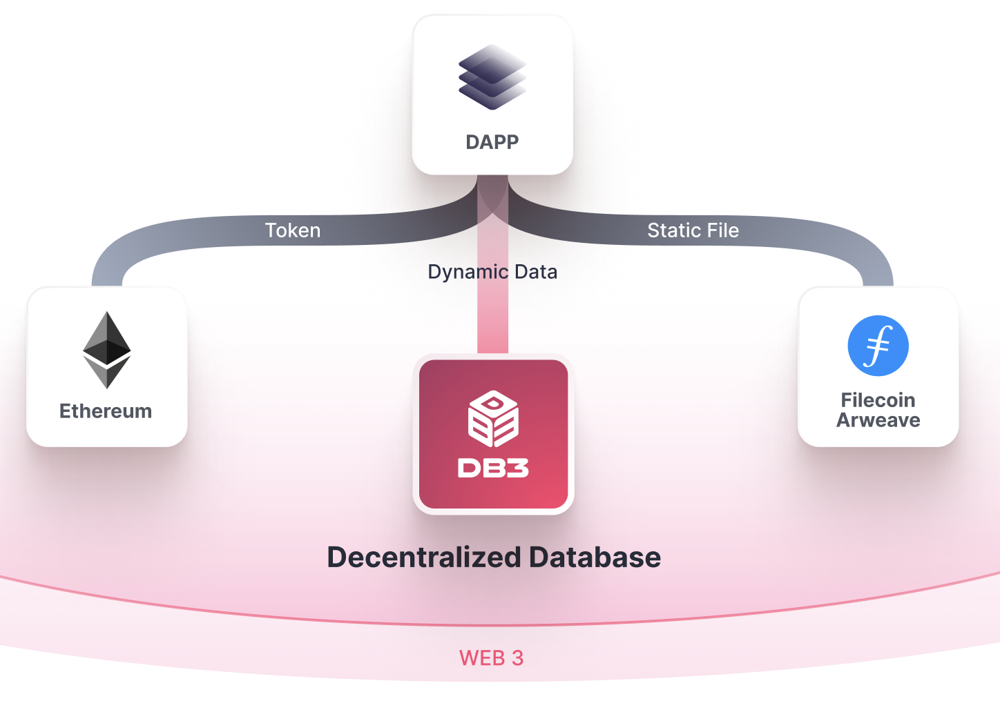
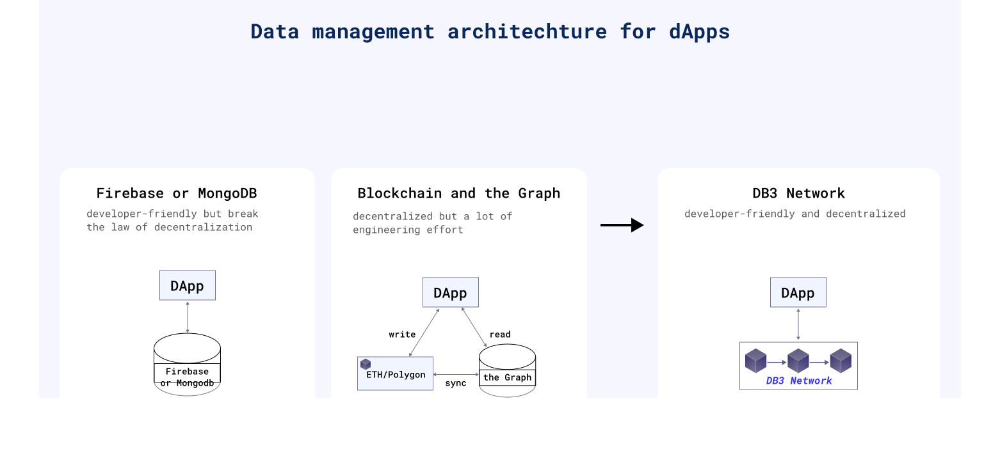

 

 A ⭐️ is welcome!
  

**English | [中文](./README_zh_cn.md)**

## DB3 Network

DB3 Network is a robust and secure **decentralized data network** designed to tackle the expected problems faced by dApps. These applications frequently require the ability to **CRUD** vast amounts of user-generated data, all while maintaining a decentralized architecture. By utilizing DB3 Network, you can effortlessly create data-intensive applications such as social networking apps, gamefi, and more.

 

## **Guide Line of DB3**

---

- Before create your dApp, you need to create database or find the existing database you can use on **[DMS website](./docs/build/data_manager.md)**
- Try **[Quick Start](./docs/build/quick_start.md)** or based on **[ReactJS Demo](./docs/build/demos/js_demo.md)** to build your dApps with DB3 Network as your decentralized database
- Since running a dApp need connect with a node, you can ether find a existing node from **[Commuity nodes](./docs/build/node/community_node.md)** or
- Try **[Run Local Node](./docs/build/node/run_locally.md)** to host your own nodes
<!-- - Go deeper by reading **[Network](../network/overview.md)** and the **[Advanced](../advanced/overview.md)**specification -->

## **Build dApps**

---

### **[Refer to DB3.js =>](https://github.com/dbpunk-labs/db3.js)**

DB3 Network is a database the same as Firestore but in a decentralized way. DApps can directly interact with DB3 Network with db3 client. A properly designed `db3.js` package allow you do the "CRUD" job in the client never be easier

## **Run DB3 Node**

---

DB3 network is community owned and everyone is ecouraged to be part of the network. You can run a DB3 node to provide data storage, compute and bandwidth for dApps and earn make a good profit from that.

- **[Run Locally Node](./docs/build/node/run_locally.md)**

## DEMOS

- **[Create database](https://dms.db3.network)** and the related **[Github repository](https://github.com/dbpunk-labs/data-manager)**
- **[Message wall](https://message-wall-iota.vercel.app/)** A website where people can login with metamask and leave a message and the project **[Github repository](https://github.com/dbpunk-labs/message-wall)**
- **[Todo MVC](https://db3-network-crud-todomvc-demo.imotai.repl.co/)** and the related **[Github repository](https://github.com/dbpunk-labs/db3.js/tree/main/examples)**

## Why DB3 Network

Currently, there are two types of Data architecture for dApp(decentralized application): centralized vs. decentralized.

**Centralized**: use [Firebase](https://firebase.google.com)
or [MongoDB](https://github.com/mongodb/mongo)to store the data), both of which are developer-friendly. However, dApps would be regarded as less secure based on a central database.

**Decentralized**: use Ethereum or other blockchains to store the data and use [the Graph](https://thegraph.com/en/) to index data from it. The separation of the storage and the indexer would cost a lot of engineering efforts in future development.

With Db3 network, you can get both advantages of the above two choices.

# Features

**Schemaless**

You can store data on DB3 Network without any change.

**High Performance**

Currently, decentralization means terrible performance, but DB3 is trying to improve it significantly:

- [Merkdb](https://github.com/dbpunk-labs/db3/issues/100) is the storage engine of the DB3 Network, and it has high Performance and fast-proof generation.
- Geo distribution: the nodes in every storage shard are geo-distributed, and the clients can execute queries against the nearest storage node.
- [Query session](./docs/query.md), the first decentralized query protocol to resolve Performance and incentive perfectly.

**Data Ownership**

We proposed [the document level ownership](https://github.com/dbpunk-labs/db3/issues/271), and every document has its owner, while only the owner holds the private key can update/delete the record. DB3 network generates the proofs and provides signatures to prove the membership (db3 has the specific document) and ownership.

**Programmable**

Dapp developers can develop data processing contracts and deploy them to the DB3 Network, just like the data backend in web2.

**Ethereum Guarded Security**

DB3 Network is a layer2 network on Ethereum and Ethereum guards all the assets.

# Project assistance

- Add a GitHub Star⭐️ to the project.
- Tweet about how to use DB3 network.
- Write blogs about the project on [Dev.to](https://dev.to/), [Medium](https://medium.com/) or your personal blog.

Together, we can make db3 network better!

# How it works

go to the [dips](https://github.com/dbpunk-labs/DIPs) for more 

# Other Decentralized Database

- [the graph](https://github.com/graphprotocol/graph-node), a decentralized on-chain indexer
- [Locutus](https://github.com/freenet/locutus), a decentralized key-value database
- [ceramic network](https://github.com/ceramicnetwork/ceramic), a decentralized data network that brings unlimited data composability to Web3 applications
- [kwil](https://github.com/kwilteam), the first permissionless SQL database for the decentralized internet
- [spaceandtime](https://www.spaceandtime.io/), a decentralized data Warehouse
- [OrbitDB](https://github.com/orbitdb/orbit-db) is a serverless, distributed, peer-to-peer database

# License

Apache License, Version 2.0
([LICENSE-APACHE](LICENSE-APACHE) or http://www.apache.org/licenses/LICENSE-2.0)

# Contribution

Unless you explicitly state otherwise, any contribution intentionally submitted
for inclusion in the work by you, as defined in the Apache-2.0 license, shall be
dual licensed as above, without any additional terms or conditions.
See [CONTRIBUTING.md](CONTRIBUTING.md).
