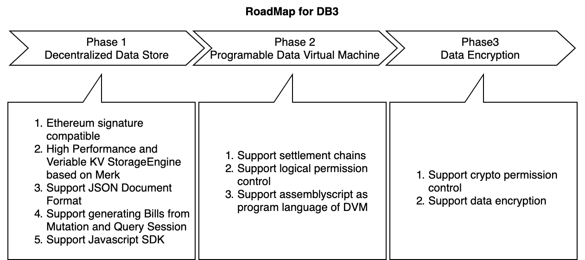

[](https://github.com/db3-teams/db3/actions)


# What's DB3


db3 has the following  concepts

**1 [Mutation](./docs/mutation.md)** All operations on data modification are defined as mutation.You can use mutation to insert, update and delete data

**2 [Query](./docs/query.md)** Reading data from the storagement chain is defined as query. You can use query to read all data that you own

**3 DVM** Data Virtual Machine

**4 Bills**

**5 Storage Chain**

**6 Settlement Chain**

**7 Service Reward**

**8 Staking Reward**


# Getting Started

## Build

```
git clone https://github.com/dbpunk-labs/db3.git
cd db3 & base install_env.sh && cargo build
```
## Run Localnet

```
# run localnet
cd tools && bash start_localnet.sh
# open another terminal , enter db3 dir and run db3 shell
./target/debug/db3 shell
WARNING, db3 will generate private key and save it to ~/.db3/key
restore the key with addr 0x0dce49e41905e6c0c5091adcedee2dee524a3b06
>put ns1 k1 v1 k2 v2
submit mutation to mempool done!
>get ns1 k1 k2
k1 -> v1
k2 -> v2
>account
 total bills | storage used | mutation | querys | credits
  3400 tai    | 76.00        | 1        | 0      | 10 db3
```

# Roadmap



# Archtecture

# Media
* [all in web3探索个人数据主权](https://www.muran.me/%E7%A6%BB%E8%81%8C%E9%98%BF%E9%87%8Call-in-web3%E6%8E%A2%E7%B4%A2%E4%B8%AA%E4%BA%BA%E6%95%B0%E6%8D%AE%E4%B8%BB%E6%9D%83)
# License
Apache License, Version 2.0
   ([LICENSE-APACHE](LICENSE-APACHE) or http://www.apache.org/licenses/LICENSE-2.0)

# Contribution

Unless you explicitly state otherwise, any contribution intentionally submitted
for inclusion in the work by you, as defined in the Apache-2.0 license, shall be
dual licensed as above, without any additional terms or conditions.
See [CONTRIBUTING.md](CONTRIBUTING.md).
