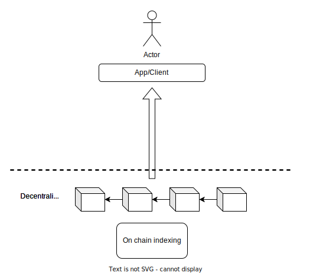
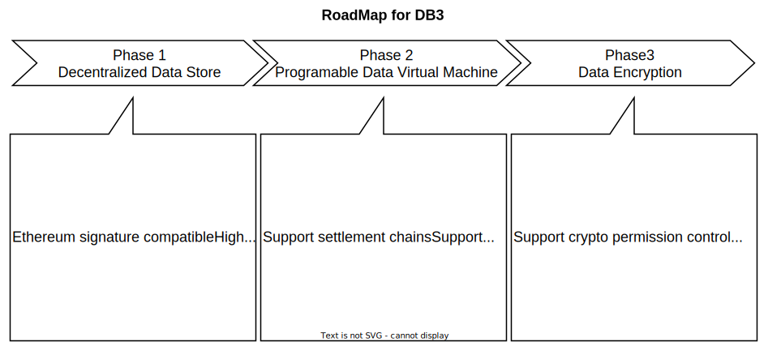

[](https://github.com/db3-teams/db3/actions)


# What's DB3?
DB3 is a delegated storage chain which contains the following 3 main features:

1. Dynamic structured data file which can be mutated easily just like Mysql.
2. On-chain indexing which allows direct querying.
3. A complete access control system based on private key.

What does these features exactly mean? Let’s explain these features in detail.
## Dynamic structured data
What is dynamic structured file? It’s a specific file structure definition in comparison with static file structure. 

Let’s put it in an easy way. A picture is a non-structured file and an Excel file is a structured file. You can easily update one line in Excel file but you can never or at least very hard to change some content on a picture, right? 

Let’s say you save a file that contains the following lines:

| id | name | address |
| --- | --- | --- |
| 12 | Lisa | Street 1, London |
| 13 | Lily | Street L, Tokyo |

When you upload this file to Arweave or IPFS, you will receive a CID or a key which allows you to retrieve this file later. Let’s assume the key is a hash of the file: `w2vdykrtjkwiphwekaywqhcjze` . 

If someone wants to know Lisa’s address, you have to give him/her the key of the file and he/she load the whole file from the network. Wait! He just want to know one line of the file, why you have to offer the whole thing. This is apparently an unwise way since this is very inefficient. Imagine this is a 10GB file and downloading the file cost half an hour. I don’t even mention the privacy thing here. This is exactly how does Arweave work now. You see the problem here.

What’s more, if someday the address of Lisa changes and you want to update this form, there’s no way to change just one line of the exiting file, the only way you can do is to upload a completely new file and get a new CID of the file. The result is a lot of redundant file exit on the storage system and waste a lot of storage. 

The way that file system like IFPS or Arweave designed is not for high efficient read and write.They are more like a cold back-up storage system.

However, with DB3 everything is much easier. We don’t provide a hash key or CID of a file but a `Table` under a specific `Namespace` . The records in the table are dynamic and can be queried or changed easily. That’s what we call `dynamic structured data.`

That’s the biggest difference between DB3 and Arweave or Arweave alike static file storage system.


## On-chain Indexing
Indexing is key part for internet. Indexing is working whenever you’re searching something from giant search engine like Google or small website like ethersan. When you login to a website with your account id, it knows who you are and what information is behind the account id. Or when you type in an address on ethersan’s search inbox it returns you all the history transactions belong to the address. Those all the work of indexing. But who is providing those indexing? Let’s take Ethereum blockchain as example. As we all know that the ethereum miners or validators just work as safe guard to protect the safety of ethereum network. The main job of miners is to propose, execute and verify each block but do not provide query services for client even through they actually store all transaction data. The main reason they don’t or can’t act as server is that the data is not well structured for query purpose. Other reason like tokenomic rewards also need to take into consideration.


As to DB3, data store and query have been taken into consideration from the first day as we design DB3 network. Miners or validators in DB3 play as storage node and query node. Clients can query data from miners directly. The miners will not only be rewarded by storing data but also providing data query service. Of cause, the result of the query will be validated by all the validators on the network since every node on the network cannot be trusted. 



## Data Access Control
Since data on DB3 is dynamic table, there must be someone who can  insert record into table, update records and delete records or even the whole table. The process of changing file records is called Mutation. Every table on-chain is belongs to or controlled by an account.  Only the account have the right to mutate the table.


# How does DB3 works?


db3 has the following  concepts

**1 [Mutation](./docs/mutation.md)** All operations on data modification are defined as mutation.You can use mutation to insert, update and delete data

**2 [Query](./docs/query.md)** Reading data from the storagement chain is defined as query. You can use query to read all data that you own

**3 [DVM](./docs/dvm.md)** Programable Data-Processing Virtual Machine. You can use typescript to develop your smart contract and deploy it to db3

**4 [Bills](./docs/bills.md)** Bills will be generated when a mutation or query has been submitted to db3


# Getting Started

## Build

```
git clone https://github.com/dbpunk-labs/db3.git
cd db3 & bash install_env.sh && cargo build
```

## Play With DB3

```
# run localnet
cd tools && bash start_localnet.sh
# open another terminal , enter db3 dir and run db3 shell
./target/debug/db3 shell
@db3.network🚀🚀🚀
WARNING, db3 will generate private key and save it to /home/jackwang/.db3/user.key
restore the key with addr 0x97b478ac2bef8762c2ecc08417f35838c4bf73fc
>get ns1 k1
Open Session Successfully!
Some(OpenSessionResponse { session_id: 2, session_timeout_second: 3600, max_query_limit: 1000 })
>put ns1 k1 v1
submit mutation to mempool done!
>get ns1 k1
k1 -> v1
>account
 total bills  | storage used | mutation | querys | credits
 0.000000 db3 | 38.00        | 2        | 0      | 10 db3
```

# Roadmap



# Architecture


# Archtecture

# Media
* [all in web3探索个人数据主权](https://www.muran.me/%E7%A6%BB%E8%81%8C%E9%98%BF%E9%87%8Call-in-web3%E6%8E%A2%E7%B4%A2%E4%B8%AA%E4%BA%BA%E6%95%B0%E6%8D%AE%E4%B8%BB%E6%9D%83)
# License
Apache License, Version 2.0
   ([LICENSE-APACHE](LICENSE-APACHE) or http://www.apache.org/licenses/LICENSE-2.0)

# Contribution

Unless you explicitly state otherwise, any contribution intentionally submitted
for inclusion in the work by you, as defined in the Apache-2.0 license, shall be
dual licensed as above, without any additional terms or conditions.
See [CONTRIBUTING.md](CONTRIBUTING.md).
