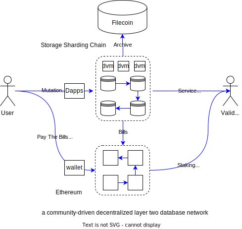

<p align="center" width="100%">
    
</p>

<p align="center" width="100%">
A star ⭐️ is welcome.
</p>


[](https://github.com/dbpunk-labs/db3/issues?q=is%3Aopen+is%3Aissue+label%3A%22good+first+issue%22)

[](https://twitter.com/Db3Network)

[](https://www.gitpoap.io/gh/dbpunk-labs/db3)

**English | [中文](./README_zh_cn.md)**

# What's DB3 Network

DB3 Network is an open-source decentralized firebase firestore alternative to build data-rich dapps quickly with minimal engineering effort.

# Why DB3 Network


without the db3 network, if you want to build a data-rich dapp .e.g a social dapp,  you have two choices
1. use a centralized data architecture .e.g firebase or MongoDB to store the data
2. use Ethereum or other blockchains to store data and use the graph to index data. the blockchain can keep the data ownership and the graph can provide a fast on-chain query

the first choice is so easy for you to develop the data-rich dapps but it breaks the law of decentralization, the second can keep the decentralization but will cost a lot of engineering effort. so with the db3 network, you can both develop the data-rich dapps with minimal engineering effort and can keep the decentralization. this is the reason why we need the db3 network

# Features

**Infinite Storage Space**

Scalability is critical in the web3 era; DB3 will use the following strategies to achieve dApp's scalability:
  * Personal computers is enough to maintain the minimum network node requirements so everyone can join the db3 network to provide storage space.
  * Using dynamic sharding to scale out: when a storage shard chain does not have enough space to store [mutation](./docs/mutation.md), the original shard chain will split itself into two subchains.
  * Archiving the cold data to recycle storage space: historical cold blocks and cold state data will be archived to FileCoin, so new incoming data can always be stored.

**Blazed Fast and Provable On-chain Query**

Currently,decentralization means terrible performance, but DB3 is trying to improve significantly:
* [Merkdb](https://github.com/dbpunk-labs/db3/issues/100) is the storage engine of the DB3 network, and it has high performance and also fast-proof generation. 
* Geo distribution: the nodes in every storage shard are geo-distributed, and the clients can execute queries against the nearest storage node.
* [Query session](./docs/query.md), the first decentralized query protocol to resolve performance and incentive perfectly. 

**Crypto Native Data Ownership**

We proposed [the document level ownership](https://github.com/dbpunk-labs/db3/issues/271), and every document has its owner, while only the owner who holds the private key can update/delete the record. DB3 network generates the proofs and provides signatures to prove the membership (db3 has the specific document) and ownership.

**Programming on-chain in web2 manner**

Dapp developers can develop data processing contracts and deploy them to the DB3 network just like developing data backend in web2.

**Ethereum Guarded Security**

DB3 network is a layer2 network on Ethereum and Ethereum guards all the assets.

Looking for more details?go to the [background introduction](./docs/background.md)

# Getting Started

### Start A Local Testnet

```shell
git clone https://github.com/dbpunk-labs/db3.git
cd db3 && bash install_env.sh && cargo build
# start localnet
cd tools &&  sh start_localnet.sh
```

### Start building

```typescript
/*
|----------------------------|
| use db3js open a database  |
|----------------------------|
*/

// build sign function
const sign = await getSign()

// build database factory
const dbFactory = new DB3Factory({
    node: 'http://127.0.0.1:26659',
    sign,
    nonce
})

// open database with a address
const db = dbFactory.open("0x5ca8d43c15fb366d80e221d11a34894eb0975da6")
```
for more please go to [db3.js](https://github.com/dbpunk-labs/db3.js)

# Project assistance

* Add a GitHub Star⭐️ to the project.
* Tweet about how to use DB3 network.
* Write blogs about the project on [Dev.to](https://dev.to/), [Medium](https://medium.com/) or your personal blog.

Together, we can make db3 network better!


# The internal of db3



# The Architecture


more technical details
* [mutation](./docs/mutation.md)
* [query session](./docs/query.md)
* [dvm](./docs/dvm.md)
* [merkdb](https://github.com/dbpunk-labs/db3/issues/100)


# Other Decentralized Database

* [the graph](https://github.com/graphprotocol/graph-node), a decentralized on-chain indexer
* [Locutus](https://github.com/freenet/locutus), a decentralized key-value database
* [ceramic network](https://github.com/ceramicnetwork/ceramic), a decentralized data network that brings unlimited data composability to Web3 applications
* [kwil](https://github.com/kwilteam), the first permissionless SQL database for the decentralized internet
* [spaceandtime](https://www.spaceandtime.io/), a decentralized data Warehouse
* [OrbitDB](https://github.com/orbitdb/orbit-db) is a serverless, distributed, peer-to-peer database

# License
Apache License, Version 2.0
   ([LICENSE-APACHE](LICENSE-APACHE) or http://www.apache.org/licenses/LICENSE-2.0)

# Contribution

Unless you explicitly state otherwise, any contribution intentionally submitted
for inclusion in the work by you, as defined in the Apache-2.0 license, shall be
dual licensed as above, without any additional terms or conditions.
See [CONTRIBUTING.md](CONTRIBUTING.md).
