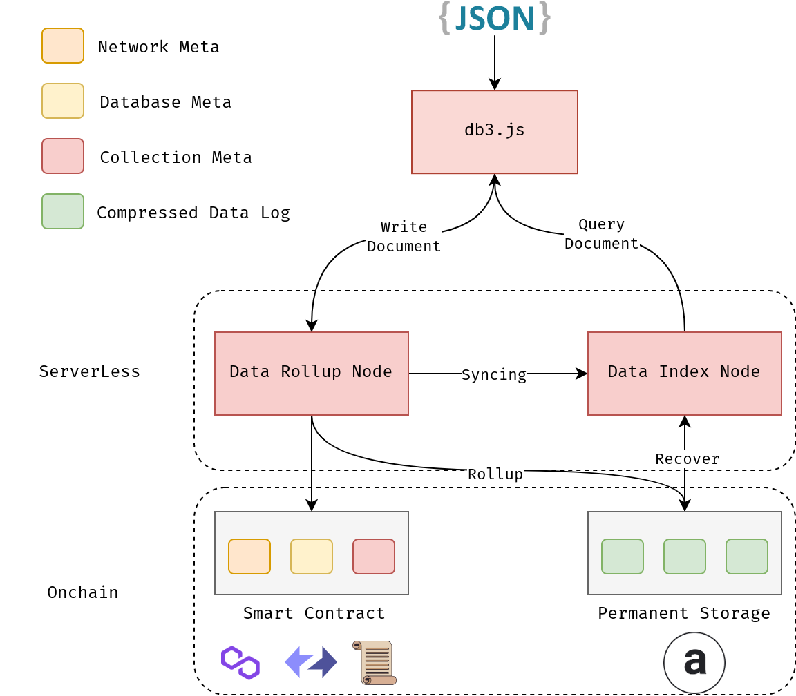

<p align="center">
 


[](https://github.com/dbpunk-labs/db3/issues?q=is%3Aopen+is%3Aissue+label%3A%22good+first+issue%22)
[](https://twitter.com/Db3Network)
[](https://www.gitpoap.io/gh/dbpunk-labs/db3)
[](https://discord.gg/sz3bmZx2uh)


# DB3 Network

DB3 Network is a Lightweight, *Permanent* JSON document database for Web3. It is designed to store and retrieve data for decentralized applications built on blockchain technology. DB3 Network has two core features:

1. Using DB3 Network as a JSON document database. 
2. Periodically rolling up the JSON document to the [Arweave](https://www.arweave.org/) at a very low cost.

# Have a try


## Set up self-hosted Node

**1. Start docker container**

```shell
sudo docker run -p 26639:26639 -p 26619:26619 -p 26629:26629 \
                -e ADMIN_ADDR=0xF78c...29679 \ # use your own wallet address
                -it ghcr.io/dbpunk-labs/db3:latest 
```

you should see the following output
```
start store node...
start index node...
the ar account address e_i_JLA8toEr5HaHCpkZJUIXp3kypCAd5NNAvfWNOgE
start ar testnet ...
10000000000000Start the local db3 nodes successfully
The storage node url: http://127.0.0.1:26619
The index node url: http://127.0.0.1:26639
The console url: http://127.0.0.1:26629
```

**2. Setup the node**

* open the `http://127.0.0.1:26629/` to setup your node for the first time
* open the `http://127.0.0.1:26629/database` to create database or collection
* open the `http://127.0.0.1:26629/node/dashboard` to vist the dashboard

**3. Playground**

open the `http://127.0.0.1:26629/database` to create database or collection, then go the playgound

```typescript
// create a account
const account = createRandomAccount()
// create the client
const client = createClient('http://127.0.0.1:26619',
                            'http://127.0.0.1:26639', 
                             account)

// get the collection
// please replace the database address and collection name with yours
const collection = await getCollection("0xF7..79", "book", client)

// add a document
const {id} = await addDoc(collection, {
                name:"The Three-Body Problem"，
                author:"Cixin-Liu",
                rate:"4.8"} as Book)
// query the document
const resultSet = await queryDoc<Book>(collection, "/[author=Cixin-Liu]")
```

if you have any questions, please feel free to ask us for help and you can find more detail about the example
* the doc for [createClient](https://docs.db3.network/functions/createClient.html)
* the doc about [queryDoc](https://docs.db3.network/functions/queryDoc.html)


# Try the testnet

## Try the testnet console
[https://testnet.db3.network/home](https://testnet.db3.network/home)

## Try the sdk
| Public Chains   |      Testnet      |  Mainnet |
|----------|:-------------:|:------:|
| zksync   |data rollup node:`https://zksync.rollup.testnet.db3.network` <br> data index node:`https://zksync.index.testnet.db3.network`  | :soon: |
| scroll   |data rollup node:`https://scroll.rollup.testnet.db3.network` <br> data index node:`https://scroll.index.testnet.db3.network`  | :soon: |


You can connect to the Data Rollup Node and Data Index Node with db3.js
Note: the cloud sandbox is just for testing and unstable


# How it works

The DB3 Network has two roles:

1. The **Data Rollup Node** accepts write operations, compresses the data, rolls it up to Arweave, and stores the metadata in the smart contract.
2. The **Data Index Node** synchronizes data from the Data Rollup Node in real-time or recovers the index with metadata in the smart contract and files in Arweave. It serves the index as a queryable API.

To prevent tampering, every 
JSON document must be signed by its owner. Only the owner can update or delete the JSON document.
<p align="center">


## The Plan to support public chain list 

| Public Chains   |      Testnet      |  Mainnet |
|----------|:-------------:|:------:|
| Arweave |  :heavy_check_mark: | :heavy_check_mark:|
| Polygon |   :heavy_check_mark: [Mumbai](https://mumbai.polygonscan.com/address/0xb9709cE5E749b80978182db1bEdfb8c7340039A9) |   :soon: |
| Zksync | :heavy_check_mark:[testnet](https://goerli.explorer.zksync.io/address/0xB4Ec19674A67dB002fFDeB83e14f9849DA3D1020) |   :soon: |
| Scroll | :heavy_check_mark: [alpha](https://scroll.l2scan.co/address/0x91B4BB6c2e6F70F93D89B04c049bFB2D36839d9A) |   :soon: |
| Arbitrum | :soon: |   :soon: |
| Optimism | :soon: |   :soon: |
| Linea| :heavy_check_mark: [testnet](https://goerli.lineascan.build/address/0xfFe5128735D2EFC1bFDF2eD18A99D1eD8d096D94) | :soon: |

If you want us to support the other public chains, just give us an [issue](https://github.com/dbpunk-labs/db3/issues/new?assignees=&labels=enhancement&projects=&template=feature_request.md&title=)

# What can we build with the db3 network?

Now building a fully on-chain application is an easy thing. You can create a fully on-chain game or a fully on-chain social network, or any other application you desire.

# FAQ

Q: Is the DB3 Network a blockchain?

A: No, the DB3 Network is not a blockchain. It is simply a developer tool that can be hosted locally or used through our cloud service.

Q: What are the differences between MongoDB and DB3 Network?

A: MongoDB uses centralized data storage, whereas DB3 Network uses decentralized data storage. Additionally, DB3 Network ensures that data is permanently available.

Q: Will my data be lost if the Data Rollup Node or Data Index Node is not available?

A: No, you can set up your data index node and recover your data from the blockchain.

# License

Apache License, Version 2.0
([LICENSE-APACHE](LICENSE-APACHE) or http://www.apache.org/licenses/LICENSE-2.0)

# Contribution

Unless you explicitly state otherwise, any contribution intentionally submitted
for inclusion in the work by you, as defined in the Apache-2.0 license, shall be
dual licensed as above, without any additional terms or conditions.
See [CONTRIBUTING.md](CONTRIBUTING.md).
