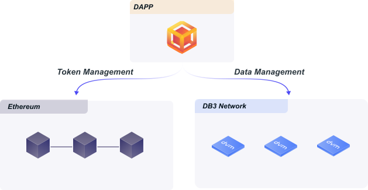

<p align="center">
 
<p align="center"> A ⭐️ is welcome!
  
<p align="center">
</p>


[](https://github.com/dbpunk-labs/db3/issues?q=is%3Aopen+is%3Aissue+label%3A%22good+first+issue%22)

[](https://twitter.com/Db3Network)
[](https://www.gitpoap.io/gh/dbpunk-labs/db3)
[](https://discord.gg/sz3bmZx2uh)

**[English](./README.md) | 中文**

# 什么是DB3 Network

DB3 Network是一款开源的去中心化的firebase替代品，在DB3 Network上面可以低成本快速构建复杂的去中心化数据应用

<p align="left">
 
</p>

# 为什么需要DB3 Network


在没有db3 network情况下，如果你想构建一个复杂的去中心化数据应用，比如去中心社交，你有两种选择
1. 用中心化的数据库架构，比如使用firestore或者mongodb来存储和读取数据
2. 用以太坊或者其他公链来存储数据，用thegraph来索引数据，通过区块链能够保证数据去中心化，用thegraph可以提供快速的链上查询功能

第一个方案可以非常轻易的开发出复杂应用，但是因为引入了中心化架构，会打破去中心带来的好处；第二个方案可以实现真正的去中心化，但是开发成本很高，所以在有db3 network之后你可以方便的开发出既能保证去中心化，还能有复杂数据逻辑的去中心化应用

# 功能列表

**无限存储空间**

规模化成为了web3发展一个非常重要的特性，db3 network是通过以下方式来实现存储空间的规模化
  * 加入网络门槛很低，让很多PC机器可以加入网络，这保证了db3 network有大量矿工节点来提供存储空间
  * 动态网络分片,当分片存储空间到达单个分片存储容量上限，可以通过分裂操作来增加分片
  * 历史块数据归档，可以通过归档操作讲矿工节点存储空间释放出来

**快速的和可证明的链上查询引擎**

* [Merkdb](https://github.com/dbpunk-labs/db3/issues/100) 是一款通过高效证明和查询的存储引擎
* [Query session](./docs/query.md) 可以保证的在提供查询性能同时，还能保证给查询服务者提供查询激励

**加密原生数据拥有权**

db3 network里面每一行数据都有自己唯一的[归属权](https://github.com/dbpunk-labs/db3/issues/271), 每一行数据只有拥有者通过自己的私钥才能去修改

**数据可编程**

db3 network提供类typescript的编程语言来开发智能合约

**有以太坊保证安全**

DB3 network 是基于以太坊的一个2层网络， 这样所有的资产的安全性可以由以太坊保证安全


# 快速开始

### 启动一个本地网络

```shell
git clone https://github.com/dbpunk-labs/db3.git
cd db3 && bash install_env.sh && cargo build
# start localnet
cd tools &&  sh start_localnet.sh
```

### 开始构建

```typescript
/*
|----------------------------|
| use db3js open a database  |
|----------------------------|
*/

// build sign function
const sign = await getSign()

// build database factory
const dbFactory = new DB3Factory({
    node: 'http://127.0.0.1:26659',
    sign,
    nonce
})

// open database with a address
const db = dbFactory.open("0x5ca8d43c15fb366d80e221d11a34894eb0975da6")
```
for more please go to [db3.js](https://github.com/dbpunk-labs/db3.js)

# 项目贡献

* 点赞转发⭐️ .
Together, we can make db3 network better!


# db3 网络内部实现


# 架构图


更多技术细节
* [mutation](./docs/mutation.md)
* [query session](./docs/query.md)
* [dvm](./docs/dvm.md)
* [merkdb](https://github.com/dbpunk-labs/db3/issues/100)


# 其他去中心化数据

* [the graph](https://github.com/graphprotocol/graph-node), 去中心化索引
* [Locutus](https://github.com/freenet/locutus), 去中心kv数据库
* [ceramic network](https://github.com/ceramicnetwork/ceramic), 去中心化数据网络
* [kwil](https://github.com/kwilteam), 去中心的支持SQL的数据库
* [spaceandtime](https://www.spaceandtime.io/), 去中心化数据仓库
* [OrbitDB](https://github.com/orbitdb/orbit-db) ，一个无服务的p2p数据库

# Thanks support

 **I stood on the shoulders of giants and did only simple things. Thank you for your attention.**
<table>
  <tr>
    <td align="center"><a href="https://protocol.ai/"><br /><sub><b>Protocol Labs</b></sub></a></td>
    <td align="center"><a href="https://filecoin.io/"><br /><sub><b>Filecoin</b></sub></a></td>
  </tr>
</table>


# License
Apache License, Version 2.0
   ([LICENSE-APACHE](LICENSE-APACHE) or http://www.apache.org/licenses/LICENSE-2.0)

# Contribution

Unless you explicitly state otherwise, any contribution intentionally submitted
for inclusion in the work by you, as defined in the Apache-2.0 license, shall be
dual licensed as above, without any additional terms or conditions.
See [CONTRIBUTING.md](CONTRIBUTING.md).
