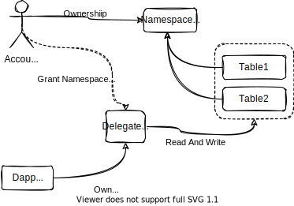

# Account Model

## Concepts

**Account** 

an account designates a pair of public key PubKey and private key PrivKey. The PubKey can be derived to generate various Addresses, which are used to identify users (among other parties) in the application

**Balance**

Every account must have some balance of db3 used to pay transaciont gas fee

**Namespace**

the Namespace belongs to account and they have a relationship of 1:N. 

**Table**

the Table which has schema and is used to store structure data belongs to Namespace 

**Ownership** 

Account has the `ownership` of `Namespace`

**Access Permission**

Account has `read` or `write` permission of `table` in `Namespace`

**Delegate**

Delegate can be granted `Access Permission` and delegate is also a `Account` 

## Interaction between User and Dapp

## Reference

* [https://docs.cosmos.network/v0.46/basics/accounts.html](https://docs.cosmos.network/v0.46/basics/accounts.html)
* [https://www.w3.org/TR/did-core/](https://www.w3.org/TR/did-core/)
