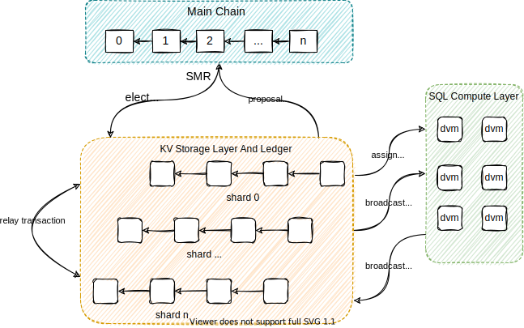

# Architecture

DB3 is a modular database network

**Main Chain**

it's global State Machine Replication layer which maintains a totally ordered log of kv storage shard block headers

**Kv Storage Shard Chains**

Every shard chain has it's ledger and works as a kv storage engine

**SQL Compute Layer**
It's a subnet which includes a lot of workers and provides power of computation