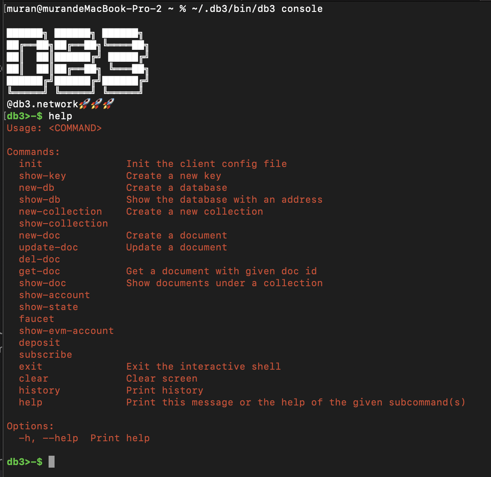

#### Step2: Connect to DB3 Network

One code is enough to connect your device to the DB3 network.
We provide several _[endpoints on dev network](./node/community_node.md)_ your can test with

```
$ db3 console --url https://grpc.devnet.db3.network
```

### Step3: Init,Create,CRUD

Now you can initialize your first **DB3 account** and create your first **on-chain database** and do some **CRUD** job

```
db3>-$ init
 address                                    | scheme
--------------------------------------------+-----------
 0x22c2941d470ce512f3a3d347918d226a9b49dd77 | secp256k1
db3>-$ new-db
 database address                           | mutation id
--------------------------------------------+----------------------------------------------
 0x51de2d0e720096bf4c5b680fce99a7f115b28820 | PJMCR8tjUMM3fjyGDwzwawj1f0Mc7JcrCokmVkpsZP8=
```

If you want to know more detail about command line , refer to [DB3-Cli](./docs/)

<p align="left">
     
</p>
