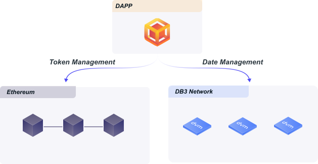

# DB3 Network Docs

DB3 Network is an open-source and decentralized firebase firestore alternative to build fully decentralized dApps quickly with minimal engineering effort

<p align="center">
 
</p>

## Getting Started

### Install

```shell
curl --proto '=https' --tlsv1.2 -sSf https://up.db3.network/db3up_init.sh | sh
```

=== "Start the localnet"

    ```shell
    db3up localnet
    ```

    open another terminal

    ```shell
    db3 console --url http://127.0.0.1:26659
    ```

=== "Join the devnet"

    ```shell
    db3up join_devnet
    ```

    open another terminal

    ```shell
    db3 console --url http://127.0.0.1:26659
    ```

    joining the devnet will take a lot of time to sync data

=== "Connect to the devnet directly"

    ```shell
    db3 console --url https://grpc.devnet.db3.network
    ```


!!! failure "command not found"
    please add the `~/.db3/bin` to the `PATH`

### Create a local keypair

```
db3>-$ init
 address                                    | scheme
--------------------------------------------+-----------
 0x96bdb8e20fbd831fcb37dde9f81930a82ab5436b | secp256k1
```
this command will create a key used for signing mutations

### Create a Database

```
db3>-$ new-db
 database address                           | transaction id
--------------------------------------------+----------------------------------------------
 0xffe0f0ea53dd3ccf6de1fc046a0f8eb68f98dded | ZJqQkwULNOuyVeeECGoHIHusyFTghsTWVJYMsg1afZM=
db3>-$ show-db --addr 0xffe0f0ea53dd3ccf6de1fc046a0f8eb68f98dded
 database address                           | sender address                             | related transactions                        | collections
--------------------------------------------+--------------------------------------------+----------------------------------------------+-------------
 0xffe0f0ea53dd3ccf6de1fc046a0f8eb68f98dded | 0x96bdb8e20fbd831fcb37dde9f81930a82ab5436b | ZJqQkwULNOuyVeeECGoHIHusyFTghsTWVJYMsg1afZM= |
```

### Create a Collection

```
db3>-$  new-collection --addr 0xffe0f0ea53dd3ccf6de1fc046a0f8eb68f98dded  --name books --index '{"name":"idx1","fields":[{"field_path":"name","value_mode":{"Order":1}}]}'
send add collection done with tx
3lY5/WKRw53x33UUZ6gCvsN4axLrdcf9PD41HqNIOYA=
db3>-$ show-collection --addr 0xffe0f0ea53dd3ccf6de1fc046a0f8eb68f98dded
 name  | index
-------+----------------------------------------------------------------------------
 books | {"name":"idx1","fields":[{"field_path":"name","value_mode":{"Order":1}}]}
```
create a collection with name `books` and an index named `idx1` in database

### Create a Document

```
db3>-$ new-doc --addr 0x997f631fcafeed5ee319c83683ae16e64783602b --collection-name books --documents '{"name": "John Doe","age": 43,"phones": ["+44 1234567","+44 2345678"]}'
send add document done with tx
+O9cK2cHLexZQvIITk4OTm8SxBhq7Yz7g+xZYiionWo=
```

## Using db3.js

### Install

=== "Install with Yarn"

    ```shell
    yarn add db3.js
    ```

=== "Install with Npm"

    ```shell
    npm install db3.js
    ```

### Hello db3.js

```typescript

// create a db3 browser wallet 
const mnemonic =
        'result crisp session latin must fruit genuine question prevent start coconut brave speak student dismiss'
const wallet = DB3BrowserWallet.createNew(mnemonic, 'DB3_SECP256K1')

// you can use metamask to connect db3 network with the following code
// const wallet = new MetamaskWallet(window)

// create a database
const [dbId, txId] = await client.createDatabase()

// connect a database with address
const {db} = initializeDB3('http://127.0.0.1:26659', dbId, wallet)

const indexList: Index[] = [
            {
                name: 'idx1',
                id: 1,
                fields: [
                    {
                        fieldPath: 'owner',
                        valueMode: {
                            oneofKind: 'order',
                            order: Index_IndexField_Order.ASCENDING,
                        },
                    },
                ],
            },
        ]
// create a collection with index and the following interface `Todo`
//
//interface Todo {
//    text: string
//    owner: string
//}
//
const collectionRef = await collection<Todo>(db, 'todos', indexList)

// add a todo
const result = await addDoc<Todo>(collectionRef, {
            text: 'beijing',
            owner: wallet.getAddress(),
 } as Todo)
```

### Demos

* [hello world with metamask](https://db3-playground-with-metamask.imotai.repl.co/)
* [todomvc](https://db3-network-crud-todomvc-demo.imotai.repl.co/)
* [create a database](https://replit.com/@imotai/ConnectToDB3?v=1)
* [create a collection](https://replit.com/@imotai/CreateACollection?v=1)

