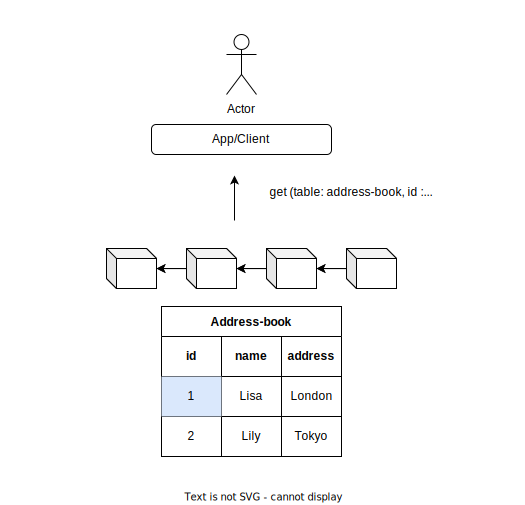
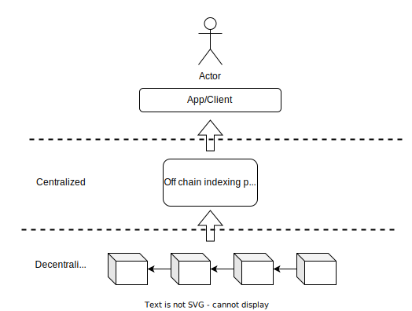
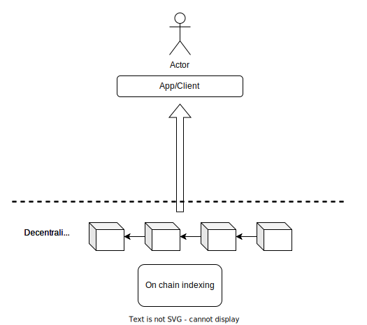
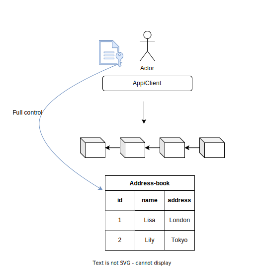
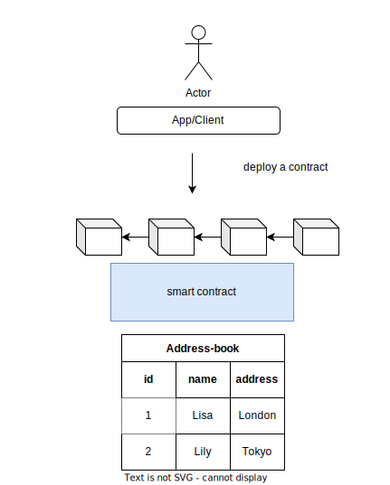

# Features of DB3 Network


First of all, DB3 is a database. As a database, it should inherit some desirable properties that traditional databases have, such as low latency, high throughput, and high scalability. On the other hand, only decentralization can make this whole project community owned and enable every user in control of their own data. DB3 as a dedicated on-chain database contains the following main features:

1. The dynamic structured data file can be mutated easily
2. Decentralization.
3. On-chain indexing which allows direct querying.
4. A complete data ownership system based on the private key.
5. Serverless: Data on-chain programmable.

What these features exactly mean? Let’s explain in detail. 

## **Dynamic structured data**
---
What is a dynamic structured file? It’s a specific file structure definition in comparison with a static file structure. 

Let’s put it in an easy way. A picture is a non-structured file and an Excel file is a structured file. You can easily update one line in an Excel file but you can never or at least very hard to change some content on a picture, right? 

Assuming you save a file that contains the following lines:

| id | name | address |
| --- | --- | --- |
| 12 | Lisa | London |
| 13 | Lily | Tokyo |

The form is just how the data is present on the website. The actual structure of the data may arbitrarily look like this (just for example, not true data structure on DB3 ):

```sql
{
	schema:[id,name,address],
  unique_index: id,
	total_count:2,
  records:[
		{ 
			id:12,
			name: Lisa,
			address: London
		},
		{ 
			id:13,
			name: Lily,
			address: Tokyo
		}
	]
}
```

When you upload this file onto Arweave or IPFS, you will receive a CID or a key that allows you to retrieve this file later. Normally the key is a hash of the file: `w2vdykrtjkwiphwekaywqhcjze`. 

If someone wants to know Lisa’s address, you have to give him/her the key of the file and he/she reloads the whole file from the network. 

Wait! He just wants to know one line of the file, and why you have to offer the whole thing. This is apparently an unwise way since this is very inefficient. Imagine this is a 10GB file and downloading the file cost half an hour. I don’t even mention the privacy problem here. But the truth is: This is exactly how Arweave works now. You see the problem here.

What’s worse, if someday the address of Lisa changes and you want to update this form, there’s no way to change just one line of the existing file. All you can do is upload a completely new file and get a new CID of the file. The result is a lot of redundant files exit on the storage system and wastes a lot of storage. 

The way that file systems like IFPS or Arweave are designed is not for highly efficient reading and writing. They are more like a cold backup storage system.

However, with DB3 everything is much easier. We don’t provide a hash key or CID but a `Table` under a specific `Namespace`. The records in the table are dynamic and can be queried or changed easily. That’s what we call `dynamic structured data.`

That’s the biggest difference between DB3 and Arweave or Arweave alike static file storage system.



## **Decentralization**
---
DB3 is standing on the shoulders of giants. We don’t invent any new concepts on the consensus mechanism. A lot of networking and consensus works of DB3 are built based on Tendermint. DB3 is composed of two main parts: The shard storage chain and the settlement chain. We somehow make DB3 a totally Byzantine Fault Tolerate network without sacrificing the low latency and scalability of the database.  The benefits of decoupling the two functional modules will be described in detail below.

## **On-chain Indexing**
---
`Indexing` is a key part of the internet. Indexing is working whenever you’re searching for something from a giant search engine like [Google](https://www.google.com) or a small website like [Ethersan](https://etherscan.io/). When you log in to a website with your account id, it knows who you are and what information is behind the account id. Or when you type in an address on Ethersan’s search inbox it returns you all the history transactions that belong to the address. Those all depend on the work of indexing. 

But who is providing those indexing? Let’s take the `Ethereum` blockchain as an example. As we all know that the Ethereum miners or validators just work as safeguards to protect the safety of the Ethereum network. The main job of miners is to propose, execute and verify each block to achieve consensus, but do not provide query services for clients through they actually store all transaction data. The main reason they don’t or can’t act as a server is that the data is not well structured for query purposes. Another reason like tokenomic rewards does not encourage miners to do an extra job like querying. 

As a result, there must be a third party to provide indexing. That’s what Infura or Alchemy are doing right now but centralized. The gap between on-chain and off-chain is inevitable.



As to DB3, in order to be engaged in the massive adoption of the incoming web3 era, data storing and data querying had been taken into account from the first day we design the network.  We do believe the gap between on-chain data production and off-chain data consumption can be eliminated. The departure of data storage and data indexing is a compromise.

Miners or validators in DB3 play both as storage nodes and query nodes. Clients can query data from miners directly. The miners will not only be rewarded by storing data but also be rewarded by providing data querying services.



## **Data Ownership System**

Since data on DB3 is a dynamic table, there must be someone who can insert records into the table, update records and delete records or even drop the whole table. The process of changing file records is called Mutation. Every table on-chain is belonged to or is controlled by an account.  Only the account has the right to update the table. That’s what we call a data control system. All data is generated by users and controlled by users.



## **Serverless: Data on-chain programmable**

As a developer, you don’t have to maintain your own cloud server or container. App developers just focus on the business logic of their app.

Developers deploy the function the app needs to the DB3 network. When the user or client wants to do some operations, for example, subscribe to someone on a decentralized forum, the client will call a function or invoke a function that does the job of writing some records into some table.

So, let’s look at some of the benefits:

- Pay for execution.

Developers don’t have to maintain a continuously running server. That means there is no idle time. You only pay for the time when the function is running. It's very cost-efficient and the functions usually run at 100 milliseconds of time.

- Auto scalable.

Since the function or coda as a contract is deployed on every storage node. Every node on the network can operate as a service provider. When you architect your apps, you're
not provisioning for any of that.

- Fast app build

Again, since you're not responsible for any of the management and deployment of any of the underlying infrastructure, you can build your apps faster, solve customer problems and bring them to market.

- Transparency of data production and consumption

Since all the code on-chain is open to the public, everyone can check the code and know exactly how does the code dealing with their data. Of cause, this will lead to the problem of privacy which will be the main subject of DB3’s Phase 3.


