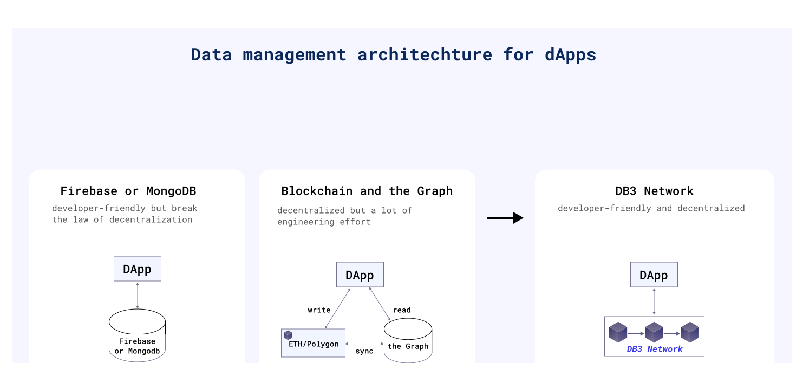
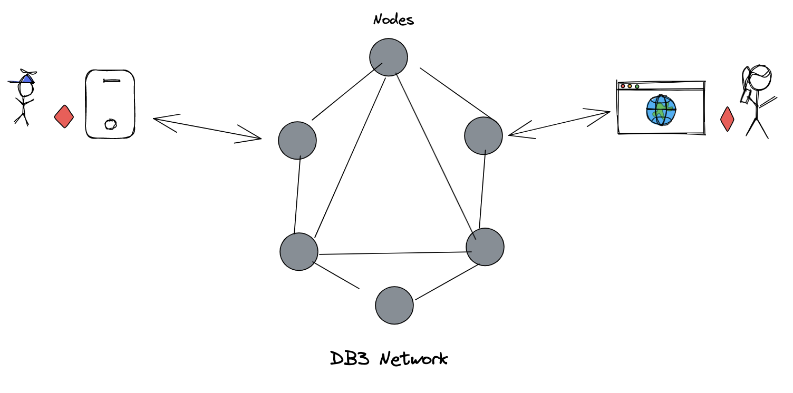
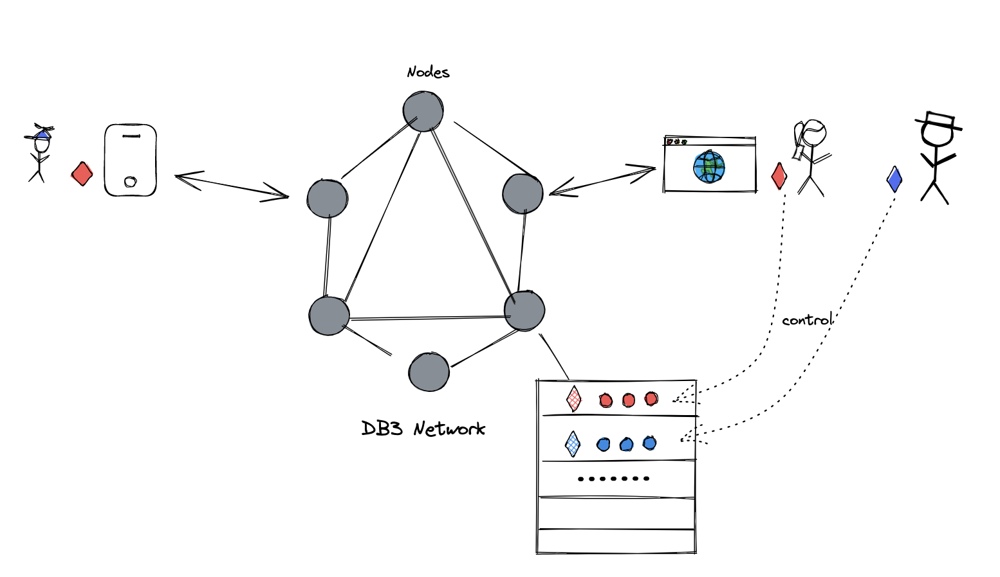
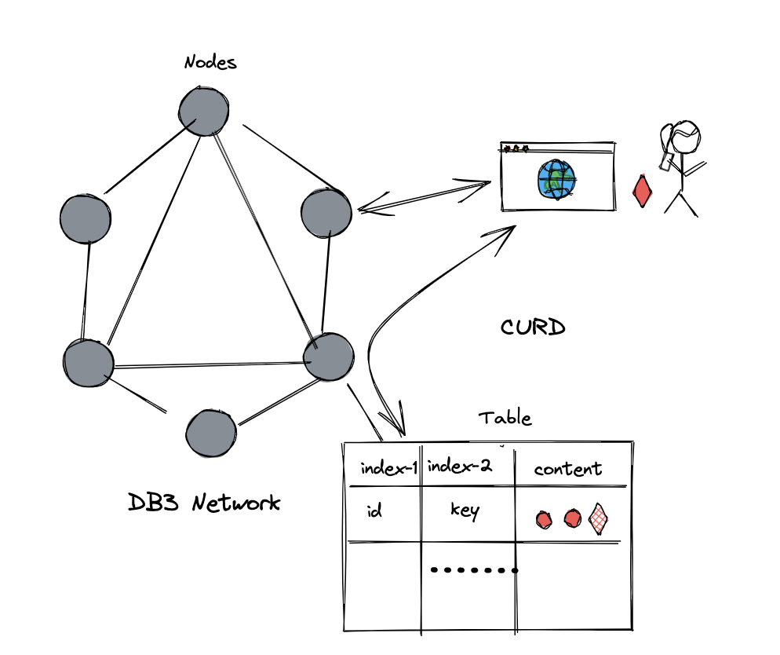
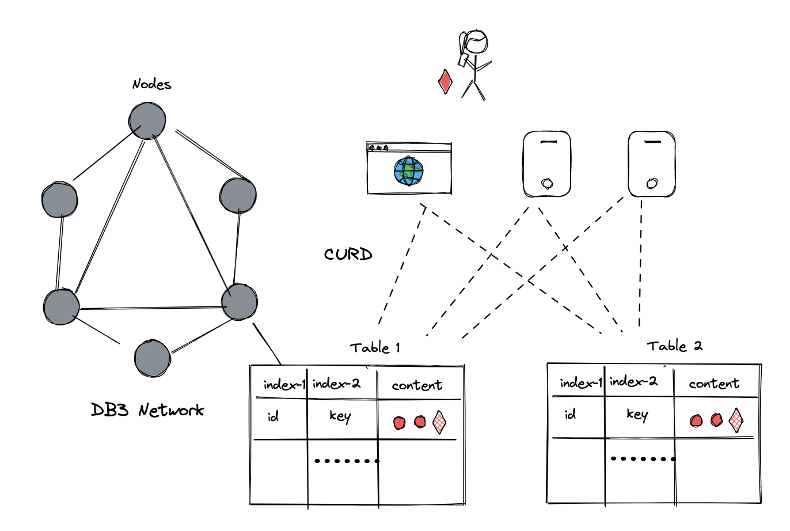
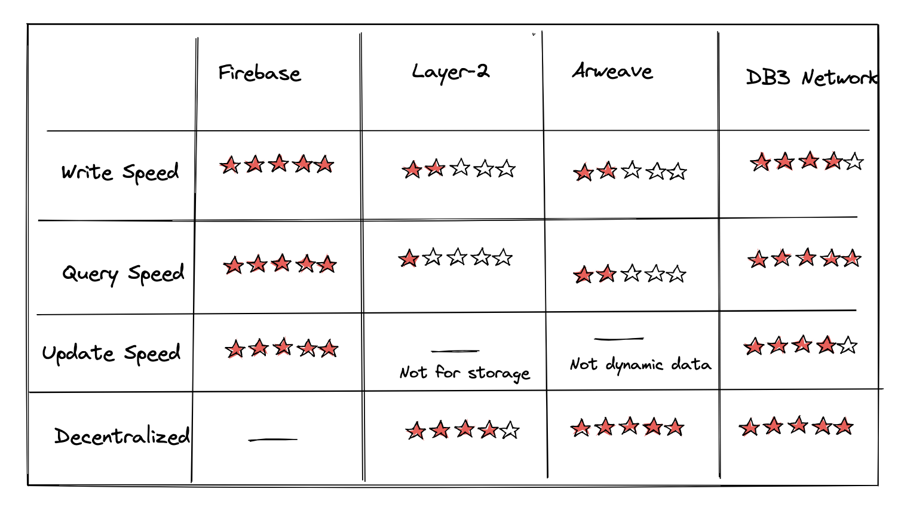

Currently, there are two types of Data architecture for dApp(decentralized application): centralized vs. decentralized.

**Centralized**: use [Firebase](https://firebase.google.com)
 or [MongoDB](https://github.com/mongodb/mongo)to store the data, both of which are developer-friendly. However, dApps would be regarded as less secure based on a central database.

**Decentralized**: use Ethereum or other blockchains to store the data and use [The Graph](https://thegraph.com/en/) to index data from it. The separation of the storage and the indexer would cost a lot of engineering efforts in future development.

With Db3 network, you can get both advantages of the above two choices.

    

# **Advantages**
---
## Decentralization
The DB3 network is totally decentralized and permissionless, allowing anyone in the world to spin up a node to provide storage, compute, and bandwidth resources to users and applications built on the network. All the nodes on the network are connected to each other and syncronize data among each other. Users or dApps could write and read data from every node. 

    

## Data Ownership
As a decentralized and permissionless network, we guarrantee the ownship of the data. No one but the user who hold the privte key can change and update their data. 

    

## Developer Experience
DB3 network provide the best developer experience. We design a well structured database and can be easilly interact with, the same as using centralized database. 
### Web2 familiar 
Since user-generated data is not the same as on-chain token. The way we storage them can be quite different. Most concepts on centralized databases apply to DB3 network, such as namespace, table, indexing.
Life is short ,you don't have so much time to learn redundant new concepts

    

### Open data
DB3 Network is an open network, all the data is available for every developer. Every database on DB3 network have a unique address just like an ETH contract. You can interact with these open databases as if interact with an ETH contract. Maybe some of require fees while others not. But they are open to public after all and belongs to no one.

    

### Blazed fast

We know what your concerned about. DB3 network is fast, blazed fast! Never under estimate what decentralized network can achieve as to speed and user experience.

Currently, decentralization means terrible performance, but DB3 is trying to improve it significantly:

**[Merkdb](../advanced/merkdb)** is the storage engine of the DB3 Network, and it has high Performance and fast-proof generation.
Geo distribution: the nodes in every storage shard are geo-distributed, and the clients can execute queries against the nearest storage node.  
**[Query session](../advanced/query_session)**, the first decentralized query protocol to resolve Performance and incentive perfectly.

    

