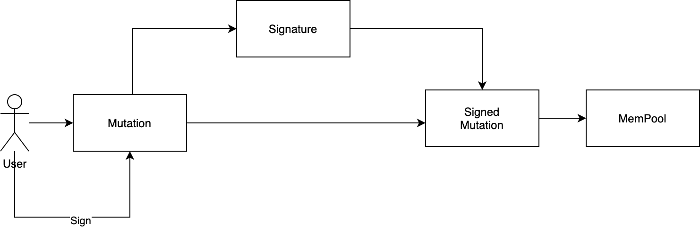

# Mutation

Mutation is the `transaction` of db3 and the insert and update operations will be packed into mutation.

## The features of Mutation

* batch insert kv pairs
* batch update kv pairs
* batch delete kv pairs
* support namespace

## The problems that Mutation will solve

* how to distribute mutation to the right network
* how to avoid relay attack

## Locate the right network

db3 use `chain role` and `chain id` to locate the right network and subchain

```protobuf=
enum ChainRole {
    SettlementChain = 0;
    StorageShardChain = 10;
    DvmComputingChain = 20;
}

enum ChainId {
    MainNet = 0;
    TestNet = 10;
    DevNet = 20;
}
```


## The Protobuf of Mutation

```protobuf=

enum MutationAction {
    Insert_Action = 0;
    Delete_Action = 1;
}

message KVPair {
    // the key of value
    bytes key = 1;
    // the value
    bytes value = 2;
    // the action of KVPair
    MutationAction action = 3;
}

message Mutation {
    // the namespace of kv pairs
    bytes ns = 1;
    // the all data to be written to db3
    repeated KVPair kv_pairs = 2;
    // replay attack protection
    uint64 nonce = 3;
    // the chain id of db3
    db3_base_proto.ChainID chain_id = 4;
    // the chain role of db3
    db3_base_proto.ChainRole chain_role = 5;
    // the price of gas
    uint64 gas_price = 6;
    // the limited of gas
    uint64 gas_limited = 7;
}

message WriteRequest {
    bytes signature = 1;
    // the protobuf binary format
    bytes mutation = 2;
    bytes public_key = 3;
}
```

## Sign Mutation


