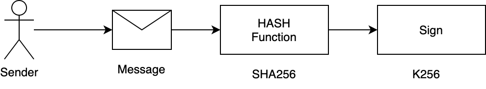

# Mutation Of DB3

## The Goal

通过合适的数据模型定义，支持DB3数据写入功能

* 需要避免重复写入问题
* 需要能够对分片区分，测试网络还是主网，结算网络还是存储网络区分
* 需要支持批量写入功能
* 设计需要能够验证身份的合法性


## Data Model

为了区分不同角色与主网与测试网络，通过ChainRole和ChainId来描述网络基础信息
```protobuf=
enum ChainRole {
    SettlementChain = 0;
    StorageShardChain = 10; 
    DvmComputingChain = 20; 
}
enum ChainId {
    MainNet = 0;
    TestNet = 10; 
    DevNet = 20; 
}
```

写入kv数据描述，并支持批量写入

```protobuf=
message KVPair {
    // the key of value
    bytes key = 1;
    // the value
    bytes value = 2;
}

message Mutation {
    // the namespace of kv pairs
    bytes ns = 1;
    // the all data to be written to db3
    repeated KVPair kv_pairs = 2;
    // replay attack protection
    int64 nonce = 3;
    // the chain id of db3
    db3_base_proto.ChainID chain_id = 4;
    // the chain role of db3
    db3_base_proto.ChainRole chain_role = 5;
}

message WriteRequest {
    bytes signature = 1;
    // the protobuf binary format
    bytes mutation = 2;                                              
    bytes public_key = 3;
}
```

## 通过签名与验证方式实现身份认证


db3使用[fastcrypto](https://github.com/MystenLabs/fastcrypto/)库来实现身份认证，


```rust
let kv = KvPair{
            key:"k1".as_bytes().to_vec(),
            value:"value1".as_bytes().to_vec(),
 };  
let mutation = Mutation {
    ns: "my_twitter".as_bytes().to_vec(),
    kv_pairs:vec![kv],
    nonce:1,
    chain_id:ChainId::MainNet.into(),
    chain_role:ChainRole::StorageShardChain.into(),
};  
let mut buf = BytesMut::with_capacity(1024 * 4); 
mutation.encode(&mut buf);
let buf = buf.freeze();
let signature: Secp256k1Signature = kp.sign(buf.as_ref());
let request = WriteRequest {
    signature: signature.as_ref().to_vec(),
    mutation:buf.as_ref().to_vec(),
    public_key: kp.public().as_ref().to_vec()
};  
let mut buf = BytesMut::with_capacity(1024 * 4); 
request.encode(&mut buf);
let buf = buf.freeze();
println!("request 0x{}",hex::encode(buf.as_ref()));
```
output
```shell
0x0a41c5286f85fd7916d1c87a69bd9fa1d7c119b1aa265891e58a05cf609535e4d7e243d18e76048494e226e890d89b516a8d91f57a3be34b30663819dc502679315600121e0a0a6d795f74776974746572120c0a026b31120676616c7565311801280a1a2102337cca2171fdbfcfd657fa59881f46269f1e590b5ffab6023686c7ad2ecc2c1c
```


