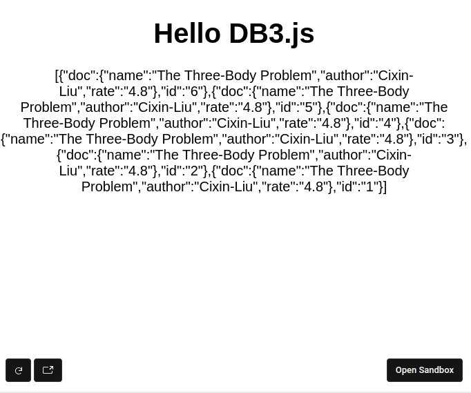

# What is db3.js


[](https://coveralls.io/github/dbpunk-labs/db3.js)

db3.js is the [db3 network](https://github.com/dbpunk-labs/db3) javascript API and you can use it to write and query JSON documents against the db3 network.
and you can build fully decentralized applications combining [web3.js](https://github.com/web3/web3.js) and db3.js

# Getting Started

## Install db3.js

```
yarn add db3.js
```

## Quick Started

```typescript
// create a account
const account = createRandomAccount()
// create the client from db3 cloud sandbox
const client = createClient('https://rollup.cloud.db3.network',
                            'https://index.cloud.db3.network',
                             account)
await syncAccountNonce(client)
// get the collection
const collection = await getCollection("0x6ef32f0d8fc6bc872ffa977eb80920a0a75d0206", "book", client)
// add a document
const {id} = await addDoc(collection, {
                name:"The Three-Body Problem",
                author:"Cixin-Liu",
                rate:"4.8"} as Book)
console.log(id)
// query the document
const resultSet = await queryDoc<Book>(collection, "/[author=Cixin-Liu]")
```



[Try on codesandbox](https://codesandbox.io/s/db3-js-helloword-447nxd?file=/src/App.tsx:673-710)


